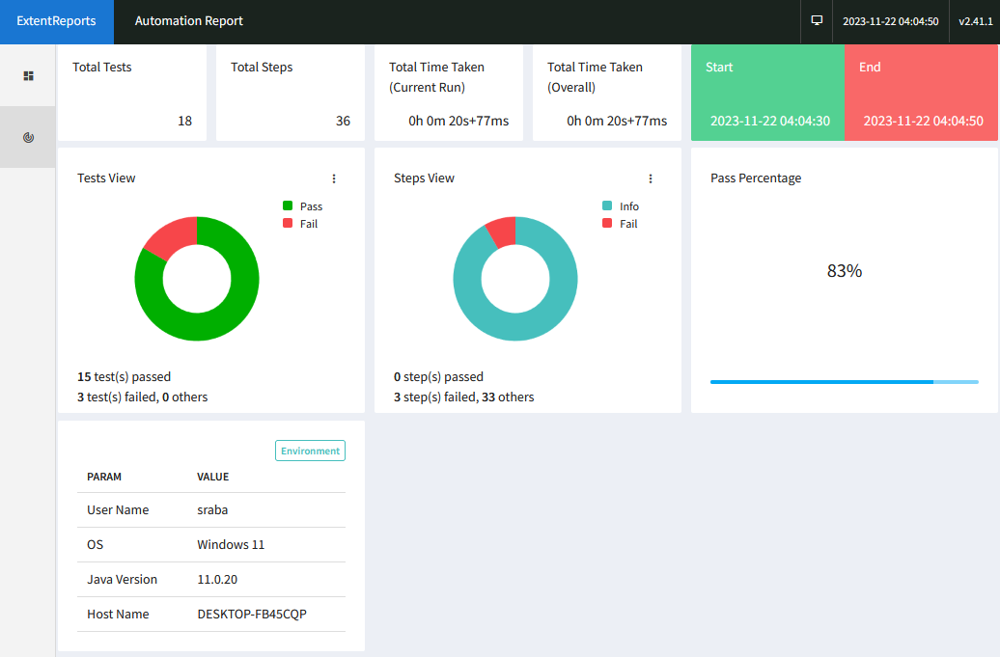
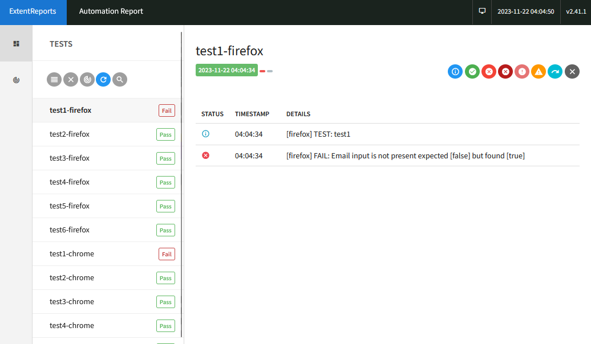

# Resolver Assessment with Selenium TestNG Framework

This Selenium Test Automation Project is built to automate testing for an html page named ["QE-index.html"](src/test/java/test_page/QE-index.html). The code is written in Java. It follows the Page Object Model (POM) design pattern. The project aims to showcase best practices in automated web testing using Selenium. The project is platform independent and can be run on any OS as long as the following prerequisites are met.

## Prerequisites

1. **Java Development Kit (JDK):** Ensure you have JDK 11 installed. You can download it from [Oracle's website](https://www.oracle.com/java/technologies/javase/jdk11-archive-downloads.html).

2. **Maven:** Make sure you have Maven installed. You can download it from [Maven's official website](https://maven.apache.org/download.cgi).

3. **WebDriver Drivers:** Download the WebDriver driver executable for the browsers you plan to test (e.g., ChromeDriver, FirefoxoDriver, EdgeDriver).

4. **Browsers:** Google Chrome, Mozilla Firefox, Microsoft Edge

## Libraries Used

- **Maven Plugin:** Version 3.2.2
- **TestNG:** Version 7.8.0
- **Selenium:** Version 4.15.0
- **WebdriverManager:** Version 5.6.0
- **Extent Report:** Version 5.0.8

These dependencies are managed in `pom.xml`.

## Getting Started

1. **Clone the Repository:**

	git clone  https://github.com/Srabani5/resolver-assessment.git

2. **Navigate to the Project Directory:**

	cd resolver-assessment

4. **Run Tests:**

The project is built and managed using Maven. The page it tests resides in the source tree and is detected automatically using relative path. Hence the tests MUST be run from the root directory of the project. On a terminal, the easiest way to run the tests is to run the following command from the root directory of the project.  

    mvn test
    
If you're using an IDE such as eclipse you can right click on the project directory and select `run as > Maven test` from the menu options.

## Test Results

At the end of each test run, the summary is printed on the terminal. The tests also generate an html report for better visualization of the test results. The report can be found under -

	report/Resolver-Assessment-Report.html
	
Here's a sample screenshot of the report summary -

The details page contains more details and logs -

Another useful but slightly less modern html report can be found under -

	target/surefire-reports/emailable-report.html
	
Upon failure of a test a screenshot of the active browser is also captured under the screenshots in the root directory. The folder will be created if it doesn't exit.	The name of the files will contain the named of the test as well as the browser used with a time stamp to avoid duplicates.  

	screenshots/

## Project Structure

The project follows a standard Page Object Model structure:

- `src/main/java/pages`: Contains Page objects.
- `src/main/java/testdata`: Contains data used for tests.
- `src/test/java/utils` : Contains listener classes.
- `src/test/java/test_page` : Contains the html test page and the test guides.
- `src/test/java/tests` : Contains test classes.
- `src/test/resources`: Contains testng configuration file such as testng.xml.
- `report/Resolver-Assessment-Report.html`: Test results report
- `pom.xml`: Maven project configuration file.

## Highlights

- **Page Object Model (POM):** The project adheres to the POM design pattern for better organization and maintenance of web elements. Please note that for this project each test section (Test1, Test2...) in the home page is organized in its own separate class for better readability and code maintenance, even though under regular best practice of POM a class usually defines a whole page. 
- **Browsers:** The project is currently designed to support three browsers - Chrome, Firefox, and Edge and they'll have to be pre-installed on the target machine. But support for others can be added in `testng.xml`.
- **Reporting:** Extent Report is used for comprehensive test reporting.
- **Screenshot on test failure:** A screenshot of the active browser is captured and stored in the screenshots folder upon test failure.

